<p align="center">
  
</p>

# OwnLore-RAG

**Chat with your own documents, privately and on your terms.**

OwnLore-RAG is a self-hosted retrieval-augmented generation (RAG) application that lets you upload documents — PDFs, spreadsheets, presentations, notebooks, even audio and video — and ask questions grounded in their actual content. Switch between 8 LLM providers at runtime, including fully local inference via Ollama, so your data never has to leave your machine if you don't want it to.

[](https://www.python.org/downloads/)
[](https://www.gradio.app/)
[](https://x.com/OwnLore)

> ✨ **Highlights**
>
> - 🔒 Privacy-First RAG
> - 🤖 8 LLM Providers
> - 🧠 CrossEncoder Reranking
> - 📄 Multi-Format Document Support
> - 🎙️ Audio & Video Transcription
> - 🎨 Gradio UI
> - 🧩 Smart Chunking
> - 💾 Local Ollama Support
> - 🔎 Search Mode
> - 📝 Document Summarization
> - 📊 500-Question Benchmark (87.0% Accuracy)

<p align="center">
  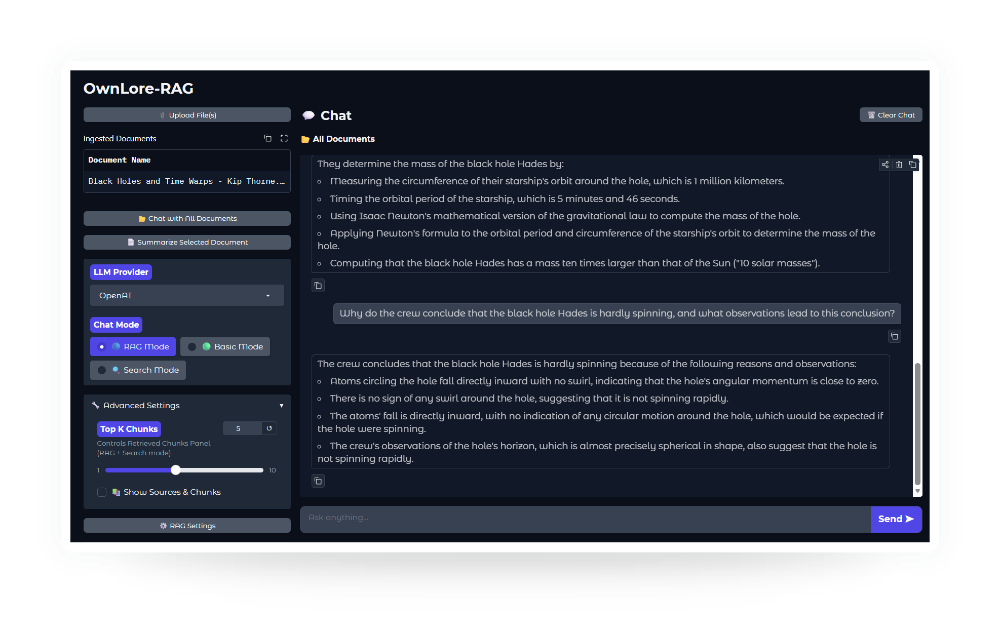
</p>

---

## Table of Contents

- [Why OwnLore-RAG](#why-ownlore-rag)
- [Screenshots](#screenshots)
- [Features](#features)
- [Quick Start](#quick-start)
- [Provider Setup](#provider-setup)
- [Configuration](#configuration)
- [Supported LLM Providers](#supported-llm-providers)
- [Supported Document Types](#supported-document-types)
- [Embedding Models](#embedding-models)
- [Project Structure](#project-structure)
- [How It Works](#how-it-works)
- [Evaluation](#evaluation)
- [Requirements](#requirements)
- [ffmpeg — Audio/Video Support](#ffmpeg--audiovideo-support)
- [Performance Notes](#performance-notes)
- [Troubleshooting](#troubleshooting)
- [Roadmap](#roadmap)
- [Contributing](#contributing)
- [License](#license)
- [Built With](#built-with)

## Why OwnLore-RAG

Most RAG demos lock you into one LLM provider or one cloud vendor. OwnLore-RAG is built to be provider-agnostic and privacy-first from the ground up:

- **Switch providers without touching code** — go from a cloud API to a fully offline Ollama model right from the in-app **LLM Provider** dropdown.
- **Local-first by design** — with Ollama, inference runs entirely on your machine and data doesn't leave your network. If you choose a cloud provider instead, your prompts and retrieved document chunks are sent to that provider's API, as required by their service.
- **Production RAG patterns out of the box** — built with smart chunking, CrossEncoder reranking, and duplicate-ingestion protection for accurate and efficient retrieval.
- **Inspectable retrieval** — a dedicated Search mode lets you see exactly which chunks were retrieved and how they scored, so you can debug bad answers instead of guessing.

---

## Screenshots

<table>
  <tr>
    <td align="center">
      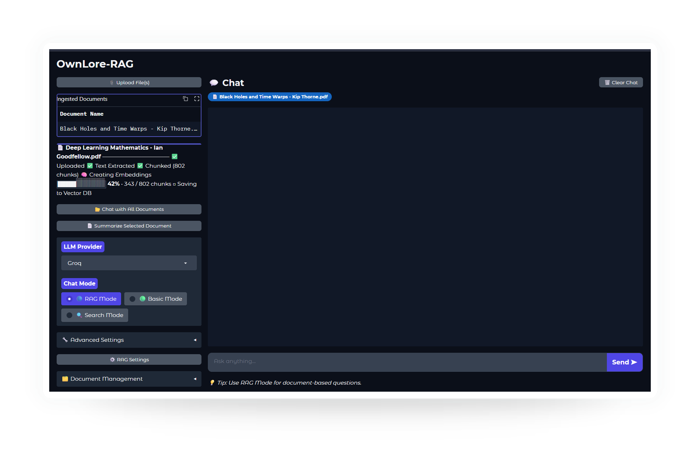<br>
      <b>Document Ingestion</b>
    </td>
    <td align="center">
      <br>
      <b>RAG Mode</b>
    </td>
    <td align="center">
      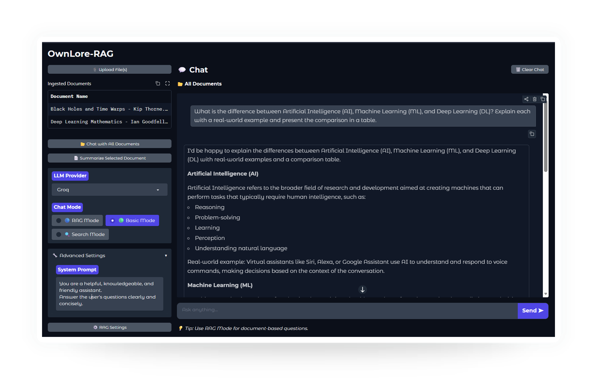<br>
      <b>Basic Mode</b>
    </td>
  </tr>
  <tr>
    <td align="center">
      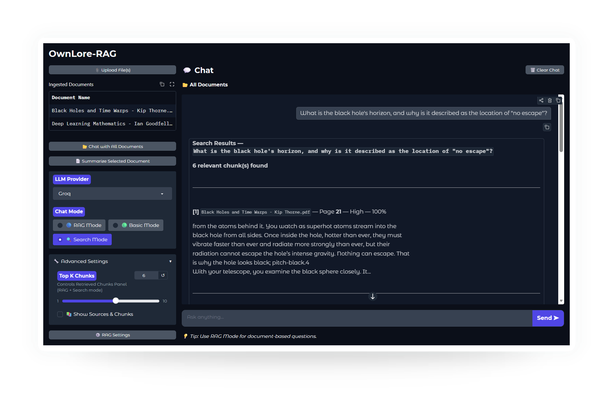<br>
      <b>Search Mode</b>
    </td>
    <td align="center">
      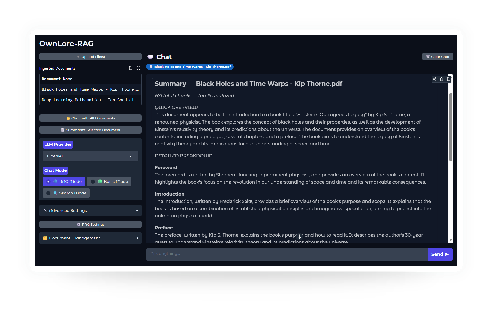<br>
      <b>Summarize Mode</b>
    </td>
    <td align="center">
      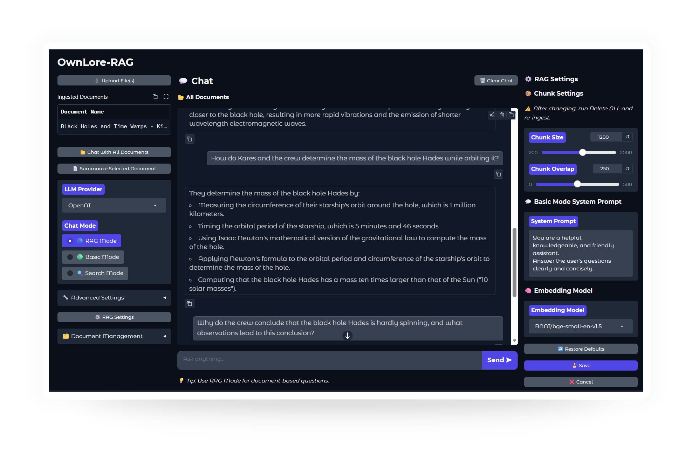<br>
      <b>RAG Settings</b>
    </td>
  </tr>
  <tr>
    <td align="center">
      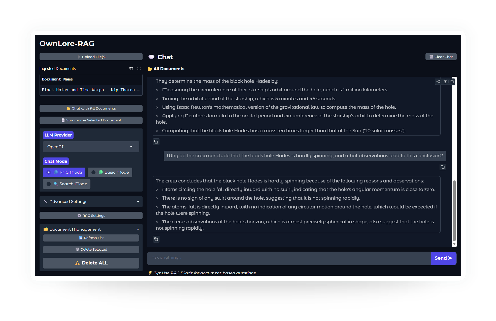<br>
      <b>Document Management</b>
    </td>
    <td align="center">
      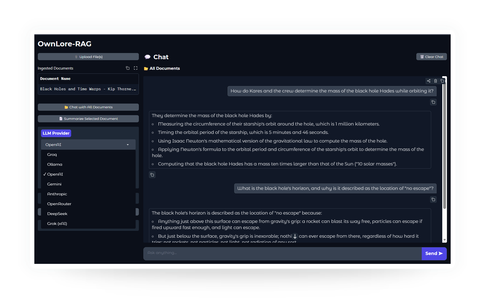<br>
      <b>LLM Provider Selection</b>
    </td>
    <td align="center">
      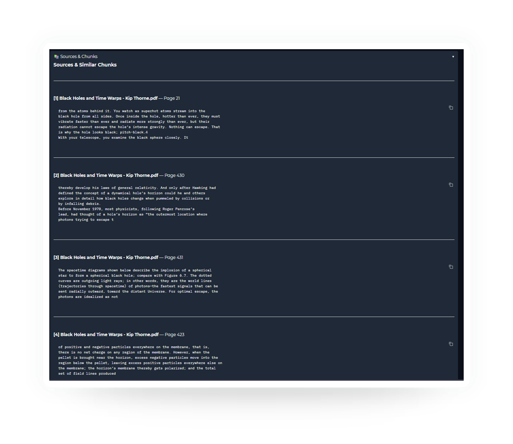<br>
      <b>Sources &amp; Chunks</b>
    </td>
  </tr>
</table>

---

## Features

- **RAG Mode** — Ask questions about your uploaded documents
- **Basic Chat Mode** — Direct LLM conversation without document context
- **Search Mode** — Inspect retrieved chunks with relevance scores
- **Summarize Mode** — Generate structured summaries of any document
- **Multi-Provider Support** — Switch between 8 LLM providers at runtime
- **Smart Chunking** — LlamaIndex-powered strategy-based document chunking
- **Dual-Framework Pipeline** — LlamaIndex for document loading/chunking, LangChain for vector storage and LLM integration
- **CrossEncoder Reranking** — Improve retrieval quality with two-stage ranking
- **Duplicate Protection** — Prevents re-ingesting the same document twice
- **Embedding Model Selection** — Choose and switch HuggingFace embedding models
- **Streaming Responses** — Token-by-token streaming with stop support
- **Document Management** — Refresh the ingested list, delete a selected document, or delete all documents at once, right from the UI
- **In-App RAG Settings** — Adjust chunk size, chunk overlap, embedding model, and the Basic Mode system prompt without touching code or restarting the app

---

## Quick Start

### 1. Clone the repository

```bash
git clone https://github.com/tusharkumar-dev/ownlore-rag.git
cd ownlore-rag
```

### 2. Create a virtual environment

> Requires Python **3.11, 3.12, or 3.13** — see [Requirements](#requirements) for full hardware/software details.

```bash
# Windows
python -m venv venv
venv\Scripts\activate

# Mac / Linux
python -m venv venv
source venv/bin/activate
```

### 3. Install dependencies

```bash
pip install -r requirements.txt
```

### 4. Configure your API key

Copy `.env.example` to `.env` and add your API keys for the providers you want to use.

```bash
cp .env.example .env
```

Add your Groq key (the default provider):

```env
GROQ_API_KEY=your_groq_api_key_here
```

Get a free Groq API key at: https://console.groq.com

> Want to use a different provider instead? See [Provider Setup](#provider-setup) for the full list of variable names and options.

### 5. Run the application

```bash
python main.py
```

Open your browser at `http://localhost:7860`

> **First document ingestion:** The selected Hugging Face embedding model is downloaded automatically the first time you ingest a document, if it isn't already available locally. An internet connection is required for this initial download. The model is cached locally afterward, and subsequent document ingestions reuse the cached model without downloading it again.

---

## Provider Setup

Every variable name is already pre-defined in `.env.example` — you never need to remember or type a variable name yourself. Copy it to `.env` and fill in the value(s) for the provider(s) you plan to use, leaving the rest blank:

```env
GROQ_API_KEY=
OPENAI_API_KEY=
GOOGLE_API_KEY=
ANTHROPIC_API_KEY=
OPENROUTER_API_KEY=
DEEPSEEK_API_KEY=
XAI_API_KEY=
```

`LLM_PROVIDER` decides which one is active — switch it live from the **LLM Provider** dropdown in the UI. Whichever provider you select, its key must already be filled in above, or you'll get an authentication error the first time you send a message.

| Provider | `LLM_PROVIDER` value | Required env var | Default model | Get a key |
|---|---|---|---|---|
| Groq | `groq` | `GROQ_API_KEY` | `llama-3.1-8b-instant` | [console.groq.com](https://console.groq.com) |
| Ollama | `ollama` | none (local) | `llama3.1:latest` | [ollama.ai](https://ollama.ai) |
| OpenAI | `openai` | `OPENAI_API_KEY` | `gpt-4o` | [platform.openai.com](https://platform.openai.com) |
| Gemini | `gemini` | `GOOGLE_API_KEY` | `gemini-3.5-flash` | [aistudio.google.com](https://aistudio.google.com) |
| Anthropic | `anthropic` | `ANTHROPIC_API_KEY` | `claude-sonnet-4-5` | [console.anthropic.com](https://console.anthropic.com) |
| OpenRouter | `openrouter` | `OPENROUTER_API_KEY` | `mistralai/mistral-7b-instruct` | [openrouter.ai](https://openrouter.ai) |
| DeepSeek | `deepseek` | `DEEPSEEK_API_KEY` | `deepseek-chat` | [platform.deepseek.com](https://platform.deepseek.com) |
| Grok (xAI) | `grok` | `XAI_API_KEY` | `grok-3` | [console.x.ai](https://console.x.ai) |

### Ollama (Local Setup)

Ollama is the only provider that needs a one-time local install instead of an API key:

```bash
# 1. Install Ollama: https://ollama.ai

# 2. Pull a model
ollama pull llama3.1

# 3. Start the Ollama server
ollama serve
```

Once the server is running, select **ollama** from the **LLM Provider** dropdown in the UI — no `.env` changes needed. The default model (`llama3.1:latest`) already matches the `ollama pull llama3.1` command above.

You're not limited to `llama3.1` — it's just the default. You can pull and use any model Ollama supports (e.g., `ollama pull mistral`, `ollama pull qwen2.5`), then update the model in `config/settings.py` to match. See [Changing the Default Model Per Provider](#changing-the-default-model-per-provider) for how.

---

## Configuration

Every setting below has a default defined directly in `config/settings.py`, which validates the final values at startup, raising an error immediately if something is out of range.

| Setting | Default | Description | How to change it |
|---|---|---|---|
| `LLM_PROVIDER` | `groq` | Active LLM provider — see [Provider Setup](#provider-setup) | UI dropdown |
| `LLM_TEMPERATURE` | `0` | LLM temperature (range: 0.0–2.0) | Edit `config/settings.py` |
| `LLM_STREAMING` | `true` | Enable token-by-token streaming | Edit `config/settings.py` |
| `LLM_MAX_TOKENS` | `1024` | Max tokens in the LLM response | Edit `config/settings.py` |
| `EMBEDDING_MODEL` | `BAAI/bge-small-en-v1.5` | HuggingFace embedding model | UI panel or edit `config/settings.py` |
| `TOP_K` | `5` | Number of chunks to retrieve (range: 1–20) | UI panel or edit `config/settings.py` |
| `SEARCH_TYPE` | `similarity` | Retrieval strategy: `similarity`, `mmr`, or `similarity_score_threshold` | Edit `config/settings.py` |
| `SCORE_THRESHOLD` | `0.5` | Minimum relevance score (used with `similarity_score_threshold`) | Edit `config/settings.py` |
| `CHUNK_SIZE` | `1000` | Characters per chunk (range: 200–2000) | UI panel or edit `config/settings.py` |
| `CHUNK_OVERLAP` | `200` | Overlap between chunks (range: 0–500, must be less than `CHUNK_SIZE`) | UI panel or edit `config/settings.py` |
| `CHROMA_DB_PATH` | `./chroma_db` | Vector database location | Edit `config/settings.py` |
| `COLLECTION_NAME` | `documents` | ChromaDB collection name | Edit `config/settings.py` |

`CHUNK_SIZE`, `CHUNK_OVERLAP`, `EMBEDDING_MODEL`, and the Basic Mode system prompt can be updated directly from the **RAG Settings** panel. Use **Restore Defaults** to reset them or **Cancel** to discard unsaved changes. Other settings require editing `config/settings.py` and restarting the application.

### Changing the Default Model Per Provider

To change which model a provider uses by default, edit the `_MODEL_MAP` dictionary directly in `config/settings.py`:

```python
_MODEL_MAP = {
    "groq":        "llama-3.1-8b-instant",
    "openai":      "gpt-4o",
    "ollama":      "llama3.1:latest",
    "gemini":      "gemini-3.5-flash",
    "anthropic":   "claude-sonnet-4-5",
    "openrouter":  "mistralai/mistral-7b-instruct",
    "deepseek":    "deepseek-chat",
    "grok":        "grok-3",
}
```

Change the value for whichever provider you want a different default model for, then restart the app.

> [!WARNING]
> If you change the embedding model or chunking settings after documents have already been ingested, you must **Delete ALL** documents and re-ingest them. Existing documents were embedded with the previous model. Using a different embedding model without re-ingesting will create inconsistent vectors and lead to silent retrieval failures.

> See [Embedding Models](#embedding-models) for the full list of switchable embedding models and reranker details.

---

## Supported LLM Providers

| Provider | API Key Required | Notes |
|---|---|---|
| **Groq** | Yes | Fast, recommended default |
| **Ollama** | No (local) | 100% local |
| **OpenAI** | Yes | GPT-4o |
| **Gemini** | Yes | Google AI Studio |
| **Anthropic** | Yes | Claude models |
| **OpenRouter** | Yes | Multi-model API |
| **DeepSeek** | Yes | Cost-effective |
| **Grok (xAI)** | Yes | xAI models |

---

## Supported Document Types

| Category  | Formats |
|-----------|---------|
| Documents | `.pdf`, `.docx`, `.pptx`, `.pptm` |
| Text      | `.txt`, `.md`, `.epub`, `.mbox` |
| Data      | `.csv`, `.ipynb` |
| Media     | `.mp3`, `.mp4` |

---

## Embedding Models

The **RAG Settings** panel (gear icon, top of the app) lets you switch between three embedding models at runtime — no code changes needed:

| Model | Size | Speed | Quality |
|---|---|---|---|
| `BAAI/bge-small-en-v1.5` (default) | 33M | Fast | Smaller, balanced |
| `BAAI/bge-base-en-v1.5` | 109M | Medium | Mid-sized |
| `BAAI/bge-large-en-v1.5` | 335M | Slower | Larger, higher-capacity |

The reranker (`cross-encoder/ms-marco-MiniLM-L-6-v2`) is fixed in code and not switchable from the settings panel.

The selected model is downloaded automatically during your first document ingestion, if it isn't already available locally, and cached afterward. An internet connection is required for this initial download; subsequent document ingestions reuse the cached model without downloading it again. For Chunk Size, Chunk Overlap, and other settings panel options, see [Configuration](#configuration).

> [!WARNING]
> Changing the embedding model after documents are already ingested requires **Delete ALL** followed by re-ingesting. Existing documents were embedded with the previous model — using a different one without re-ingesting will create inconsistent vectors and lead to silent retrieval failures.

---

## Project Structure

```
ownlore-rag/
│
├── main.py                         # Application entry point
│
├── handlers/                       # Business logic layer
│   ├── __init__.py
│   ├── chat_handler.py             # Chat response and stop-generation logic
│   ├── document_handler.py         # Document upload and deletion
│   └── settings_handler.py         # Settings management and model synchronization
│
├── ui/                             # Presentation layer
│   ├── __init__.py
│   ├── interface.py                # Gradio Blocks interface
│   ├── events.py                   # UI event wiring
│   └── styles.py                   # Custom CSS
│
├── chat/                           # Chat and RAG modes
│   ├── __init__.py
│   ├── rag_chat.py                 # Main RAG orchestration
│   ├── basic_chat.py               # Direct LLM chat
│   ├── search_mode.py              # Retrieval/search-only mode
│   ├── summarize.py                # Document summarization
│   └── source_formatter.py         # Source/citation formatting
│
├── config/                         # Configuration layer
│   ├── __init__.py
│   ├── settings.py                 # Project configuration/constants
│   ├── state.py                    # Runtime state
│   ├── prompt_config.py            # Prompt management
│   └── prompt_config.json          # Prompt configuration data
│
├── llm/                            # LLM provider layer
│   ├── __init__.py
│   └── llm_provider.py             # Multi-provider LLM loading
│
├── vectordb/                       # Vector database management
│   ├── __init__.py
│   └── document_manager.py         # ChromaDB document management/CRUD
│
├── embeddings/                     # Shared embedding model layer
│   ├── __init__.py
│   └── embeddings.py               # HuggingFace embedding model management/caching
│
├── ingestion/                      # Document ingestion pipeline
│   ├── __init__.py
│   ├── file_ingestor.py            # File → LlamaIndex Documents
│   └── rag_chunking_framework.py   # Chunking strategies
│
├── retrieval/                      # Retrieval and reranking
│   ├── __init__.py
│   ├── retriever.py                # ChromaDB similarity retrieval
│   └── reranker.py                 # CrossEncoder reranking
│
├── storage/                        # Vector storage layer
│   ├── __init__.py
│   └── vector_store.py             # LlamaIndex/LangChain → ChromaDB storage bridge
│
├── chroma_db/                      # Auto-generated vector database — created during ingestion, not source code
│
└── requirements.txt
```

---

## How It Works

The diagram below shows the full picture — document ingestion, shared retrieval/generation components, the four interaction modes, and the underlying application layers. The two flowcharts further down break the RAG Pipeline and Document Ingestion steps out in more detail.

<p align="center">
  
</p>

### RAG Pipeline

*What happens when you ask a question:*


**In short:** your question is used to find the most relevant pieces of your documents, those pieces are double-checked for quality, then handed to the LLM along with your question so it can answer using only what's actually in your files — and you can always see which chunks it used.

### Document Ingestion

*What happens when you upload a file:*


**Why two frameworks:** LlamaIndex has the stronger document loaders and chunking strategies, while LangChain has the more mature vector store and LLM integration layer. `vector_store.py` is the bridge — it converts LlamaIndex document/chunk objects into the format LangChain expects before writing to ChromaDB.

**In short:** every file you upload is turned into text and chunked by LlamaIndex, converted into numerical vectors, then handed off to LangChain (via the `vector_store.py` bridge) for storage — this is the one-time prep work that makes the RAG Pipeline above possible.

---

## Evaluation

OwnLore-RAG was evaluated using a benchmark of **500 manually curated questions** across **10 books** spanning multiple domains, including Computer Science, Machine Learning, Medicine, Physics, History, Psychology, Finance, and Self-Improvement.

### Benchmark Configuration

| Setting | Value |
|---------|-------|
| Books Evaluated | 10 |
| Total Questions | 500 |
| Questions per Book | 50 |
| Chunk Size | 1000 |
| Chunk Overlap | 200 |
| Embedding Model | `BAAI/bge-small-en-v1.5` |
| LLM | `llama-3.1-8b-instant` (Groq) |
| Retriever Top-K | 5 |
| Vector Database | ChromaDB |

### Evaluation Methodology

This benchmark uses an **LLM-as-a-Judge** evaluation approach — a separate LLM call independently grades each generated answer rather than relying on manual review alone.

For each benchmark question:

1. The question was passed through the RAG pipeline.
2. Relevant document chunks were retrieved.
3. The LLM generated an answer.
4. Generated answers were evaluated independently for:
   - Correctness
   - Completeness
   - Relevance
   - Hallucination detection

### Per-Book Results

| Book | Category | Accuracy | Correct | Partial | Incorrect |
|------|----------|---------:|--------:|--------:|----------:|
| [Atomic Habits](https://github.com/tusharkumar-dev/ownlore-benchmarks/blob/df5257b7fd16ad47ebc98d957aef8458373ef632/questions/Atomic%20Habits%20Original.txt) | Self-Improvement | 82% | 41 | 4 | 5 |
| [Black Holes and Time Warps](https://github.com/tusharkumar-dev/ownlore-benchmarks/blob/df5257b7fd16ad47ebc98d957aef8458373ef632/questions/Black%20Holes%20and%20Time%20Warps%20-%20Kip%20Thorne.txt) | Physics | 80% | 40 | 5 | 5 |
| [Hands-On Machine Learning](https://github.com/tusharkumar-dev/ownlore-benchmarks/blob/df5257b7fd16ad47ebc98d957aef8458373ef632/questions/Hands-on-Machine-Learning.txt) | Machine Learning | 82% | 41 | 2 | 7 |
| [Introduction to Algorithms (CLRS)](https://github.com/tusharkumar-dev/ownlore-benchmarks/blob/df5257b7fd16ad47ebc98d957aef8458373ef632/questions/Introduction%20to%20Algorithms-The%20MIT%20Press%20%282022%29.txt) | Computer Science | 92% | **46** | 4 | **0** |
| [Operating System Concepts](https://github.com/tusharkumar-dev/ownlore-benchmarks/blob/df5257b7fd16ad47ebc98d957aef8458373ef632/questions/Operating%20System%20Concepts.txt) | Computer Science | **94%** | **47** | 3 | **0** |
| [Sapiens](https://github.com/tusharkumar-dev/ownlore-benchmarks/blob/df5257b7fd16ad47ebc98d957aef8458373ef632/questions/Sapiens-A-Brief-History-of-Humankind.txt) | History | 90% | 45 | 4 | 1 |
| [The Psychology of Money](https://github.com/tusharkumar-dev/ownlore-benchmarks/blob/df5257b7fd16ad47ebc98d957aef8458373ef632/questions/The%20psychology%20of%20money%20-%20Morgan%20Housel%3B%20Harriman%20House.txt) | Finance | 90% | 45 | 0 | 5 |
| [Thinking, Fast and Slow](https://github.com/tusharkumar-dev/ownlore-benchmarks/blob/df5257b7fd16ad47ebc98d957aef8458373ef632/questions/Thinking%2C%20Fast%20and%20Slow%20-%20Daniel%20Kahneman.txt) | Psychology | **96%** | **48** | 0 | 2 |
| [Bailey & Love's Short Practice of Surgery](https://github.com/tusharkumar-dev/ownlore-benchmarks/blob/df5257b7fd16ad47ebc98d957aef8458373ef632/questions/Bailey_and_Love%27s_Short_Practice_of_Surgery_28th_Edition_1.txt) | Medicine | 84% | 42 | 3 | 5 |
| [Ikigai](https://github.com/tusharkumar-dev/ownlore-benchmarks/blob/df5257b7fd16ad47ebc98d957aef8458373ef632/questions/Ikigai%20_%20the%20Japanese%20secret%20to%20a%20long%20and%20happy%20life.txt) | Self-Improvement | 80% | 40 | 4 | 6 |

### Overall Results

| Metric | Value |
|--------|------:|
| Books Evaluated | 10 |
| Total Questions | 500 |
| Correct Answers | **435** |
| Partially Correct | **29** |
| Incorrect | **36** |
| Strict Accuracy | **87.0%** |

### Key Observations

- Achieved **87.0% strict accuracy** across a diverse benchmark of 500 questions.
- Best performance was observed on **Thinking, Fast and Slow** (96% accuracy) and **Operating System Concepts** (94% accuracy).
- The benchmark covers technical and non-technical domains, providing a broad evaluation of retrieval and answer generation quality.
- Remaining errors primarily resulted from incomplete answers, retrieval misses, or insufficient context from the retrieved document chunks.

### Reproducibility

The full benchmark question sets (50 questions per book, 500 total) are available in the [`ownlore-benchmarks`](https://github.com/tusharkumar-dev/ownlore-benchmarks/tree/df5257b7fd16ad47ebc98d957aef8458373ef632/questions) repository, so these results can be independently verified rather than taken at face value.

---

## Requirements

### Minimum

- Python **3.11**
- 8 GB RAM
- 4+ core CPU
- Windows 10/11, Linux, or macOS
- Internet connection *(required for cloud LLM providers and first-time embedding model downloads)*

### Supported Python Versions

- Python **3.11, 3.12, and 3.13**

### Recommended

- Python **3.11.9**
- 16 GB RAM or higher
- SSD storage
- 6+ core CPU
- Dedicated GPU *(NVIDIA CUDA, Apple Silicon MPS, or AMD ROCm where supported)*

### Conditional

- Ollama installed *(only if using local models)*
- ffmpeg installed *(only if ingesting `.mp3` / `.mp4` files — see below)*

---

## ffmpeg — Audio/Video Support

Audio (`.mp3`) and video (`.mp4`) file ingestion requires [ffmpeg](https://ffmpeg.org) to be installed and available on your system PATH. This is optional — you only need it if you plan to upload audio or video files.

### Windows

1. Download a build from https://ffmpeg.org/download.html
2. Extract it to `C:\ffmpeg\`
3. Add `C:\ffmpeg\bin` to your System PATH
4. Verify the install:
   ```bash
   ffmpeg -version
   ```

### macOS

```bash
brew install ffmpeg
ffmpeg -version
```

### Linux (Debian/Ubuntu)

```bash
sudo apt update
sudo apt install ffmpeg
ffmpeg -version
```

> If `ffmpeg -version` doesn't print a version number after installing, restart your terminal (and on Windows, log out/in) so the updated PATH takes effect.

---

## Performance Notes

### Audio & Video Transcription

OwnLore-RAG uses **OpenAI Whisper** to transcribe audio and video files before indexing them into the RAG pipeline.

| Hardware | Behavior |
|---|---|
| **CPU** | Supported, but transcription may take significantly longer for large audio or video files |
| **GPU (recommended)** | Install a CUDA-enabled version of PyTorch and use an NVIDIA GPU — this can substantially reduce transcription time compared to CPU execution |

> **Note:** To use your GPU, install the correct GPU-enabled PyTorch package for your system. Otherwise, the project will use the CPU.

**Typical workflow:**

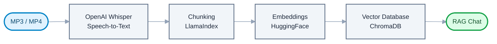

If you plan to ingest large audio/video files regularly, a CUDA-capable GPU is worth setting up — see [Requirements](#requirements) for the recommended hardware tier.

---

## Troubleshooting

### "Missing API key" / authentication error after selecting a provider
The API key for that provider isn't set in `.env`, or the variable name doesn't match exactly (for example, `GEMINI_API_KEY` instead of the correct `GOOGLE_API_KEY`). See [Provider Setup](#provider-setup) for the exact variable name each provider needs. This error typically appears when you send your first message, not when you select the provider.

### "Could not connect to tenant default_tenant"
Delete the `chroma_db/` folder and re-ingest your documents.

### "Collection expecting embedding with dimension of X, got Y"
You changed the embedding model without deleting existing data.
Use **Delete ALL** in the app, then re-ingest your documents.

### Groq responses are slow (20+ seconds)
Groq's free tier has rate limits during peak hours.
Switch to Ollama for consistent local performance.

### Ollama connection refused
Make sure the Ollama server is running:
```bash
ollama serve
```

### Import errors on startup
Make sure you activated your virtual environment and installed all dependencies:
```bash
pip install -r requirements.txt
```

---

## Roadmap

- [ ] Multi-user authentication and workspace isolation
- [ ] Support for additional vector stores (Qdrant, Weaviate)
- [ ] Docker Compose deployment
- [ ] Automated test suite and CI pipeline
- [ ] Hybrid search (keyword + vector)

Have an idea? Open an [issue](https://github.com/tusharkumar-dev/ownlore-rag/issues) or start a discussion.

---

## Contributing

Contributions are welcome. To get started:

1. Fork the repository and create a feature branch.
2. Make your changes with clear, focused commits.
3. Open a pull request describing what you changed and why.

Please open an issue first for significant changes so we can discuss the approach before you invest time in it.

---

## 📄 License

This project is licensed under the **MIT License**. See the [LICENSE](LICENSE) file for details.

---

## Built With

- [Gradio](https://gradio.app) — UI framework
- [LlamaIndex](https://llamaindex.ai) — Document loading and chunking
- [LangChain](https://langchain.com) — Vector storage and query/LLM integration
- [ChromaDB](https://www.trychroma.com) — Vector database
- [HuggingFace](https://huggingface.co) — Embedding models
- [sentence-transformers](https://sbert.net) — CrossEncoder reranking
